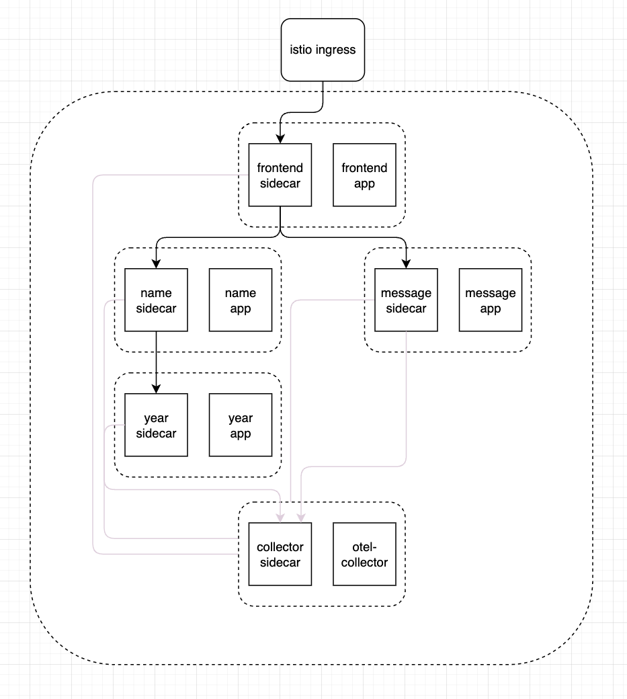
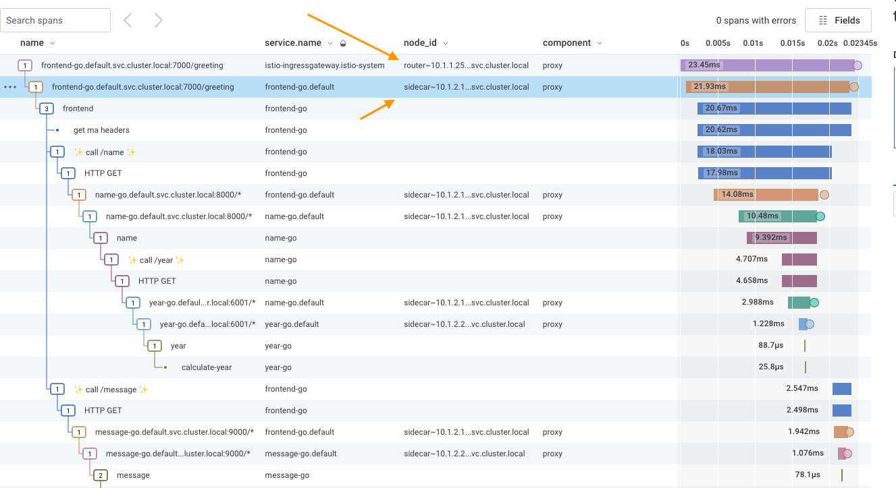

# Service Mesh Attributes

Add attributes that apply to spans created from a service mesh or other type of proxy.

## Motivation

It is not currently possible to distinguish telemetry that came from a service mesh component, such as a gateway or sidecar, or other type of proxy, and today there exists no semantic convention for designating spans as such.

## Explanation

A user may opt to include spans from service meshes, specifically gateways and sidecar proxies, as part of a full distributed trace. This is helpful to see the full lifespan of a trace, but there isn't a way to easily distinguish between different types of services, and although some services provide a field name that may be filterable, there is no consistency across providers.

For example:

- Istio uses `component:proxy` for mesh and gateways, and has spans starting with `istio.` like `istio.mesh_id`
- Kong has spans starting with `kong` like `kong.service`, but does not use `component:proxy`
- Envoy on its own uses `request.host` but doesn’t have a consistent value (`request.host:envoy-egress`, `request.host:envoy-egress:80`)

We can create and use a [general attribute](https://github.com/open-telemetry/opentelemetry-specification/blob/main/specification/trace/semantic_conventions/span-general.md) to specify various types of services, such as:

- name: `net.component`, value: `proxy`
  - This substitutes (and is duplicative) for today’s `component: proxy` in Istio, but is intended to follow existing semantic conventions for general attributes for consistency across various types of proxies
- name: `net.component.deployment`, value: `sidecar`, value: `gateway`
  - This is a more specific subset of the aforementioned `net.component`

## Internal details

Here is an example application that includes an Istio service mesh containing four microservices with sidecars, within a network accessed through a ingress gateway:



Istio already adds `component:proxy` to each span, as well as a `node_id` that is prefixed with `router` (also known as `gateway`) or `sidecar` (also known as `agent`). Expanding upon this to include an additional attribute would allow for ease of distinguishing different spans, and would negate the need to manually add these attributes (see Prior Art section).



By requiring this at the spec level, it would ensure consistency across different service meshes and proxies. It would also greatly reduce the difficulty of adding the more specific sub-type “deployment” recommended above, distinguishing between a gateway and a sidecar.

It might be helpful to include a way to override this attribute, but it may not be strictly necessary.

## Trade-offs and mitigations

Most of the service meshes and proxies today do not use OpenTelemetry for tracing. That is a bigger effort that needs to occur; this would be a starting point for when the transition happens from OpenTracing (or other format) to OpenTelemetry.

## Prior art and alternatives

When enabling tracing for a service mesh like Istio, the `meshConfig` can be modified to include `custom_tags`:

```yaml
spec:
  meshConfig:
    enableTracing: true
    defaultConfig:
      tracing:
        custom_tags:
          net.component:
            literal:
              value: proxy
        zipkin:
          address: otel-collector.default:9411
```

When sending telemetry to an OpenTelemetry Collector, one can use the [Attributes Processor](https://github.com/open-telemetry/opentelemetry-collector-contrib/tree/main/processor/attributesprocessor) to add specific attributes for the pipeline that contains the spans from the mesh:

```yaml
processors:
      batch:
      attributes:
        actions:
          - key: "net.component"
            value: "proxy"
            action: insert
```

The above representation does not include specifics on the deployment type (sidecar vs gateway) but if added manually, it would need to be done in a similar fashion. Because it need only apply to specific telemetry, it may require more granular pipelines in a collector if not additional collectors to help separate and appropriately tag spans from different deployments.

## Open questions

- What other components or delineations are missing from this list?
- We know that sidecar and gateway are considered proxies. Do we “care” whether it’s a sidecar vs a gateway, or do we just care that it’s a proxy? This is related to the complexity of manually adding the deployment type.
- Is it feasible (or even possible) to manually tag deployment type spans?

## Future possibilities

As more services continue to evolve and become even more complex, automatically identifying types of spans will be much easier than manually tagging them. The span attribute names sand values could expand to include newer types of services that either do not exist yet or that evolve over time.
